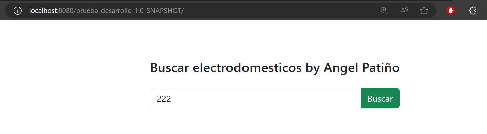
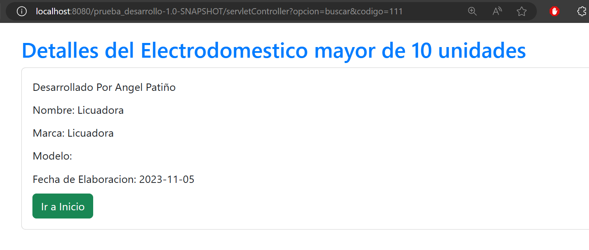
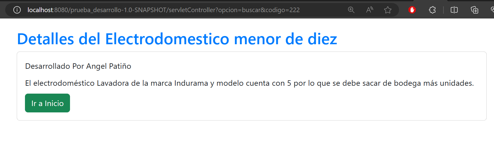

# Proyecto Electrodomésticos con Java, JSP

Este proyecto implementa una aplicación web utilizando la arquitectura MVC (Modelo-Vista-Controlador) y el patrón DAO (Data Access Object) en Java. La aplicación gestiona información sobre electrodomésticos y utiliza un MemoryStore para almacenar los objetos correspondientes.

### **Select Language:**
- [Español (Spanish)](README-es.md)
- [English](README-es.md)

## Resultados
### Inicio

### Mayor de 10

### Menor de 10

### Igual a 10

## Requisitos previos

- IntelliJ IDEA
- JDK 8 o superior
- Tomcat o cualquier servidor web compatible

## Configuración del proyecto

1. Clona o descarga el proyecto desde el repositorio.

2. Abre el proyecto en IntelliJ IDEA.

3. Configura el servidor web (Tomcat u otro) en IntelliJ.

4. Configura las dependencias del proyecto.

## Estructura del proyecto

- **`src/main/java/`**: Contiene los paquetes y clases Java.
    - **`controller/`**: Contiene los servlets que actúan como controladores.
    - **`model/`**: Contiene las clases de modelo, como Electrodomestico y MemoryStore.
    - **`dao/`**: Contiene las clases DAO para interactuar con el MemoryStore.
    - **`view/`**: Contiene las clases para las páginas JSP (Vistas).

- **`webapp/`**: Contiene los recursos web.
    - **`WEB-INF/`**: Contiene el archivo `web.xml` para la configuración de servlets.

## Configuración del MemoryStore

- En `MemoryStore.java`, se gestiona el almacenamiento de objetos Electrodomestico. Los datos incluyen código único, nombre, marca, modelo, fecha de elaboración y cantidad de unidades.

## Funcionalidades de la aplicación

1. **Cargar datos al MemoryStore directamente desde el servlet:**
    - Utiliza el servlet `CargarDatosServlet` para cargar datos al MemoryStore directamente sin necesidad de una interfaz de ingreso.

2. **Buscar electrodoméstico por código:**
    - La página `BuscarElectrodomestico.jsp` permite ingresar el código del electrodoméstico a buscar.

3. **Mostrar detalles del electrodoméstico:**
    - Si existen más de 10 unidades, se muestra la página `DetallesElectrodomestico.jsp` con información detallada (nombre, marca, modelo y fecha de elaboración).

4. **Mensaje para menos de 10 unidades:**
    - Si hay menos de 10 unidades, se muestra un mensaje en la página `MensajeUnidades.jsp` indicando que se deben sacar más unidades de bodega.

5. **Mensaje para 0 unidades:**
    - Si no hay unidades disponibles, se muestra un mensaje en la página `MensajeSinUnidades.jsp` indicando que se debe importar un lote del producto.

## Ejecución del proyecto

1. Configura tu servidor web en IntelliJ IDEA.

2. Ejecuta la aplicación y accede a la URL proporcionada por tu servidor web.

3. Explora las funcionalidades de la aplicación siguiendo las rutas especificadas para cada servlet y página JSP.

¡Disfruta del proyecto de Electrodomésticos! 🚀 