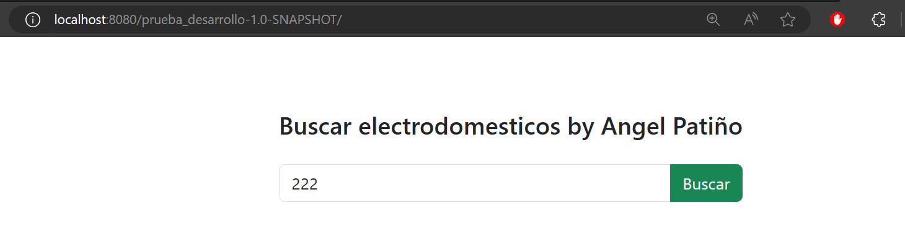
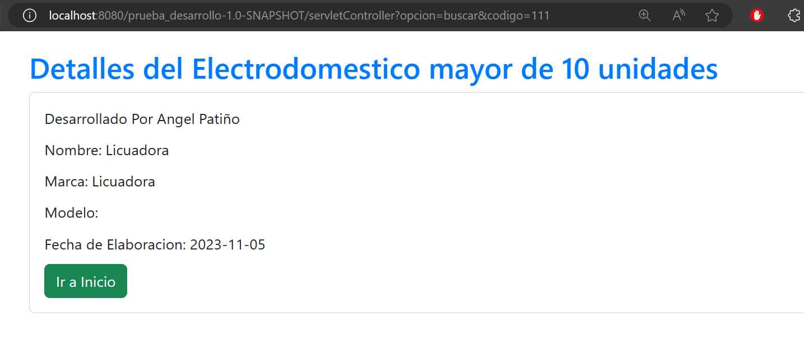
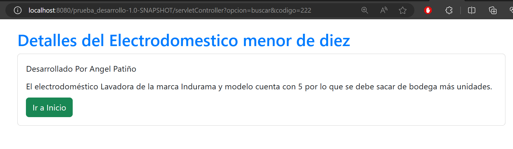
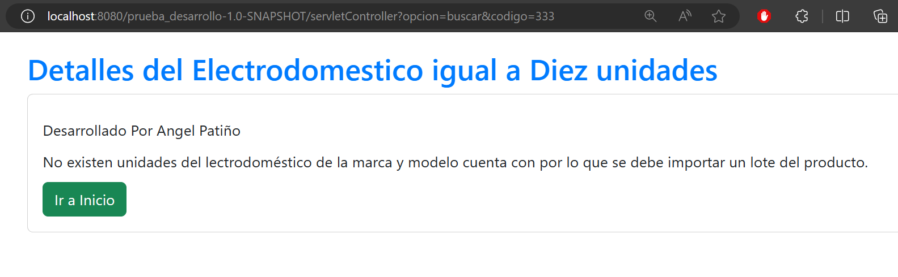

# Appliances Project with MVC and DAO in Java

This project implements a web application using the MVC (Model-View-Controller) architecture and the DAO (Data Access Object) pattern in Java. The application manages information about appliances and uses a MemoryStore to store the corresponding objects.

### **Select Language:**
- [Español (Spanish)](README-es.md)
- [English](README.md)

## Results
### Home

### Greater than 10

### Less than 10

### Equal to 10

## Prerequisites

- IntelliJ IDEA
- JDK 8 or higher
- Tomcat or any compatible web server

## Project Setup

1. Clone or download the project from the repository.

2. Open the project in IntelliJ IDEA.

3. Configure the web server (Tomcat or other) in IntelliJ.

4. Configure project dependencies.

## Project Structure

- **`src/main/java/`**: Contains Java packages and classes.
    - **`controller/`**: Contains servlets acting as controllers.
    - **`model/`**: Contains model classes, such as Electrodomestico and MemoryStore.
    - **`dao/`**: Contains DAO classes to interact with MemoryStore.
    - **`view/`**: Contains classes for JSP pages (Views).

- **`webapp/`**: Contains web resources.
    - **`WEB-INF/`**: Contains the `web.xml` file for servlet configuration.

## MemoryStore Configuration

- In `MemoryStore.java`, the storage of Electrodomestico objects is managed. Data includes unique code, name, brand, model, production date, and quantity of units.

## Application Features

1. **Load data to MemoryStore directly from the servlet:**
    - Use the `CargarDatosServlet` servlet to load data directly to MemoryStore without the need for a data entry interface.

2. **Search for appliances by code:**
    - The `BuscarElectrodomestico.jsp` page allows entering the code of the appliance to search for.

3. **Show details of the appliance:**
    - If there are more than 10 units, the `DetallesElectrodomestico.jsp` page is displayed with detailed information (name, brand, model, and production date).

4. **Message for less than 10 units:**
    - If there are fewer than 10 units, a message is displayed on the `MensajeUnidades.jsp` page indicating that more units should be taken from the warehouse.

5. **Message for 0 units:**
    - If no units are available, a message is displayed on the `MensajeSinUnidades.jsp` page indicating that a batch of the product should be imported.

## Running the Project

1. Configure your web server in IntelliJ IDEA.

2. Run the application and access the URL provided by your web server.

3. Explore the application's features by following the specified paths for each servlet and JSP page.

Enjoy the Appliances project! 🚀